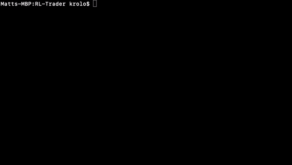

# Reinforcement Learning Stock Trader
## What:
This Reinforcement Learning Stock Trader uses a mix of human trading logic and Q-Learning to trade Equities found on Yahoo.com/finance in your terminal! 

It works by running defined trading logic for a set of historical trades, and then hands over the torch to Q-Learning for the remaining set of historical data.

## Simple Quick Guide
To use:

1. Make sure all necessary libraries are installed: Numpy, Pandas, Scipy
1. Clone this project into any directory on your machine
2. CD into the project directory
3. Pass the following commmand: ```python RL-Trader.py [EQUITY] [START DATE - DAY/MONTH/YEAR] [STARTING PORTFOLIO VALUE] [DAYS TO LEARN]```

For example: ```python RL-Trader.py F 1/1/2000 1000 100```

^ This command runs the RL script against Ford's historical data and learns using our trading logic (under ```logic/logic.py```) for 100 days before Reinforcement Learning kicks in with a starting portfolio of $1,000. The resulting Q-Table, as well as the profit, is then printed.



## What this code does well (so far)

I have found that this script works especially well against times of economic contraction. That being said, results are contingent on the trading logic given to the RL agent, as well as the attributes of the RL agent itself.

## Reinforcement Learning Logic

Unlike other Reinforcement Learning scripts, it is better to keep the greedy factor (Epsilon) low (around .05-.5) as it increases the amount of analytical decisions the script makes. Because markets have a stochastic factor, it did not make sense to have the script choose a random 'buy' or 'sell' call, but instead use logic an analyist might use (this is under ```state_logic```), only maximizing when there is enough data in the Q-Table (analagous to traders using trading strategies that have worked before).

## Add your own trading logic!
Navigate to ```Logic/logic.py``` and edit the 
```python 
def state_logic()
``` 
function (ignore the function inputs). Add your trading logic here --  when the function returns 0, the agent learns to sell. When the fucntion returns 1, the agent learns to buy.


## Planned Features to Add:
1. Calculation for Alpha compared to given Equity/Market
2. Ability to add more than one equity

If you'd like to see anything added -- feel free to message me: krolo@wisc.edu
